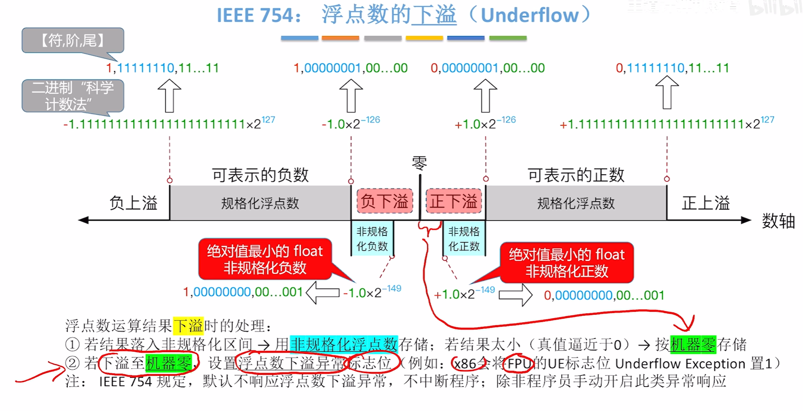
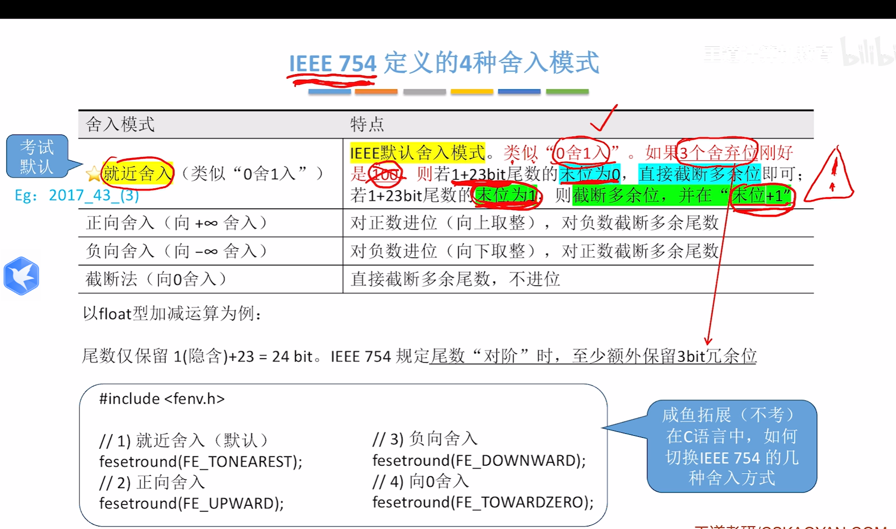

<!--
阶段0 大纲(已通过):
- 模块: 2.3 浮点数的表示与运算
- 王道范围: 2.3.1~2.3.5 (P56-P63)
- 零壹涉及: 讲义4 §2 + §3 + PPT4 后半
- 章节树:
    1. 浮点数总公式与表示范围
    2. 规格化(原码/补码两种规则)
    3. IEEE 754 标准(三段格式 + 偏置 + 隐藏位)
    4. IEEE 754 阶码全 0/全 1 的 4 种特殊编码
    5. 浮点加减(对阶 → 尾加 → 规格化 → 舍入 → 溢出)
    6. 浮点乘除(无需对阶 + 阶相加/减,尾相乘/除)
    7. 浮点 vs 定点对比 + 范围/精度
    8. C 浮点类型转换
    9. 大小端 + 边界对齐存储(王道归在 2.3.4)
- 资源清单: ASCII 图×6, 代码块×3, 对比表×7, ⚠️×14, 跨章×4
- 框架图标注: 蓝25 / 红14 / 跨章4
-->

# 模块 2.3 · 浮点数的表示与运算

> **本节解决的问题:** 定点数能表示的范围太窄(int 撑死 21 亿)、对小数力不从心。怎么用同样多的位数表示从原子尺度(10⁻²⁸)到天文尺度(10³³)的数?
> **核心脉络:** 浮点通式 N = (-1)^S · M · R^E → 规格化(让有效位用满)→ IEEE 754 标准格式 → 4 类特殊编码 → 加减乘除四步法 → 范围/精度权衡 → C 类型转换。
> **学完能做什么题:** 实数 ↔ IEEE 754 互转、阶码全 0/全 1 解释、单/双精度范围与有效位、浮点加减对阶+规格化、float/int 互转的精度损失。这一节是 408 大题三大热门之一,几乎每年都考。

---

## 一、为什么要"浮点":定点的天花板

```
   定点表示   ─────  范围窄,要表示极大或极小数会爆
                       int max ≈ 2.1×10⁹
                       
   浮点表示   ─────  范围 ≈ ±3.4×10³⁸(单精度)
                       代价:精度只有 6~7 位十进制
```

> **正是因为** 一个数 = 数值 × 比例因子,**我们才能** 用"科学计数法"思路压缩范围:**N = M × R^E**——让小数点的位置随 E "浮动",用同样的位数覆盖更大动态范围。

### 1.1 浮点数总公式

$$N = (-1)^S \cdot M \cdot R^E$$

| 字段 | 含义 | 编码 |
|---|---|---|
| **S** | 数符(0 正 1 负) | 1 位单独存 |
| **M** | 尾数(二进制定点小数) | **原码**(IEEE 754) |
| **R** | 基数 | **隐含为 2**(IEEE 754 不存) |
| **E** | 阶码(指数) | **移码**(IEEE 754 用偏置 127/1023) |

⚠️ **本质理解:** **尾数位数决定精度**,**阶码位数决定范围**。**所以才有** "字长固定时,牺牲尾数位换阶码位 → 范围扩大但精度降低"。

### 1.2 浮点数的表示范围(图 2.13)

```
─∞ ─── 负上溢 ── [可表示的负数] ── 负下溢 ── 0 ── 正下溢 ── [可表示的正数] ── 正上溢 ── +∞
       ↑                              ↑                 ↑                            ↑
     最负                          最接近 0 的负数    最接近 0 的正数              最正
```


**4 个不可表示区:**
1. **正上溢**:绝对值 > 最大正数 → 视为 +∞
2. **正下溢**:绝对值 < 最小正数 → 通常按 0 处理
3. **负下溢**:同上,负侧
4. **负上溢**:同上,负侧

⚠️ **上溢必须中断**,**下溢通常按机器零处理**。这个差别是命题追踪 2015 真题的考点。

**【一节收束】** 浮点 = 数 × 倍率,M 管精度、E 管范围。范围有限带来 4 个不可表示区,上溢致命下溢可忽略。

---

## 二、规格化:让尾数 "用满"

### 2.1 为什么需要规格化

> 同一个数有多种浮点写法:
> 0.408408 × 10³ = 4.08408 × 10² = 40.8408 × 10¹...
> 但只有 **4.08408 × 10²** 是规格化的——**有效位充满整个尾数,没有浪费**。

**规格化的数学定义(基数 = 2):**

$$\frac{1}{2} \leq |M| < 1$$

即尾数最高位**必须是有效位 1**,小数点紧贴最高有效位之后。

### 2.2 原码 / 补码两种规格化形式(零壹图表)

| 规格化标准 | 正数尾数形式 | 负数尾数形式 |
|---|---|---|
| **原码规格化** | **0.1xx...x** | **1.1xx...x** |
| **补码规格化** | **0.1xx...x** | **1.0xx...x** |

⚠️ **关键差别(命题追踪 2.3 题):** 补码下负数最大值 -1/2 的尾数形式是 **1.10...0**,**而 -1 的尾数形式是 1.00...0**(规格化负数,"1.0..." 严格表示一定的负小数)。

### 2.3 左规与右规

- **左规(乘以 2):** 当尾数高位出现连续 0(形如 ±0.0...01xx),**尾数左移一位、阶码减 1**;**可能多次**。
- **右规(除以 2):** 当尾数最高位前**多了一个 1**(运算溢出,形如 ±1x.xxx),**尾数右移一位、阶码加 1**;**最多一次**。

⚠️ **左规阶码减 → 可能下溢**;**右规阶码加 → 可能上溢**。这条直接命中 2015 真题"浮点溢出判断"。

**【二节收束】** 规格化是为了"用满"尾数;基数为 2 时,原码规格化 0.1xx/1.1xx,补码规格化 0.1xx/1.0xx;左规多次右规一次。

---

## 三、IEEE 754 标准:统一江湖的工业格式

### 3.1 三段式格式

```
单精度 float (32 位):
    ┌─┬─────────────┬─────────────────────────────────┐
    │S│  阶码 8位    │       尾数 23位                  │
    └─┴─────────────┴─────────────────────────────────┘
     ↑    ↑                ↑
    符号  E (偏置 127)     M (隐藏位 1)

双精度 double (64 位):
    ┌─┬───────────────┬───────────────────────────────┐
    │S│   阶码 11位    │     尾数 52位                  │
    └─┴───────────────┴───────────────────────────────┘
                          ↑
                       (偏置 1023)
```

### 3.2 三大约定(必背)

**约定 1 · 阶码用移码,但偏置 = 2^(k-1) - 1(不是 2^(k-1))**

- 单精度 8 位阶码:偏置 = **127**(不是 128)
- 双精度 11 位阶码:偏置 = **1023**(不是 1024)

⚠️ 这是 IEEE 754 与"经典移码"最大的区别。**所以 E_存 = E_真 + 偏置**。

**约定 2 · 尾数用原码,且最高位 1 隐藏(隐含位)**

> 因为规格化二进制数尾数最高位必为 1,**既然必为 1,那干脆不存**——**省下 1 位用于多表 1 位精度**。
> **所以单精度尾数实际是 24 位(23 显式 + 1 隐藏)**。

**约定 3 · 阶码全 0 / 全 1 用作特殊编码**

| 阶码 | 尾数 | 解释 | 备注 |
|---|---|---|---|
| 全 0 | 全 0 | **±0** | 由 S 决定正负 |
| 全 0 | 非 0 | **非规格化数** | 阶码取 1-bias,尾数无隐藏位 |
| 全 1 | 全 0 | **±∞** | 上溢标志 |
| 全 1 | 非 0 | **NaN** | "Not a Number"(0/0、∞-∞ 等) |
| 其他 | 任意 | 规格化数 | 主体 |

### 3.3 编码规则速查(命题追踪 2017、2018、2024)

**规格化数:**
- 阶码取值范围:**1 ~ 254**(单精度,共 8 位)
- 真实指数 E = 阶码 - 127
- 尾数 M = **1.f**(隐含位 1 + 23 位 f)

**非规格化数:**
- 阶码字段 = 全 0,但**真实指数 E = 1 - 127 = -126**(单精度)⚠️
- 尾数 M = **0.f**(无隐含位)
- 用途:① 表示 ±0(尾数也全 0);② 表示**非常接近 0 的数**;③ **填补最小规格化数与 0 之间的"缺口"** ⭐

> **零壹独家洞察:** 非规格化数的设计**让最大非规格化数和最小规格化数之间间隔尽可能小**——画在数轴上是**渐进无缝**衔接,而不是断崖。**这就是为什么** IEEE 754 在 0 附近的数密度比远处大得多。

```
数轴示意(零壹图):
   ─────|──|─|···0···|─|──|──────
   规格化←  非规格化  非规格化  →规格化
        密                   密
        ↑ 在 0 附近变密,精度仍可用
```

### 3.4 范围与有效位(必背表)

| 类型 | 总位 | 阶码 | 尾数 | 偏置 | 最大正规格化 | 最小正规格化 | 有效十进制位 |
|---|---|---|---|---|---|---|---|
| **单精度 float** | 32 | 8 | 23 | 127 | (2−2⁻²³)·2¹²⁷ ≈ **3.4×10³⁸** | 1.0·2⁻¹²⁶ ≈ **1.18×10⁻³⁸** | **6~7 位** |
| **双精度 double** | 64 | 11 | 52 | 1023 | (2−2⁻⁵²)·2¹⁰²³ ≈ **1.8×10³⁰⁸** | 1.0·2⁻¹⁰²² ≈ **2.23×10⁻³⁰⁸** | **15~16 位** |

### 3.5 实数 ↔ IEEE 754 双向转换(命题追踪 2011/2013/2020/2022/2023)

**例 2.5 · 十进制 -8.25 → IEEE 754 单精度:**

```
1) 转二进制:8.25 = 1000.01₂
2) 规格化:  1000.01 = 1.00001 × 2³  → E_真 = 3
3) 阶码:    E_存 = 3 + 127 = 130 = 10000010₂
4) 尾数:    舍弃隐藏位 1,留 .00001 → 补 0 凑 23 位 = 00001 00000 00000 00000 000
5) 符号位:  S = 1(负)
6) 拼接:    1│10000010│00001000000000000000000
7) 答案:    1100 0001 0000 0100 0000 0000 0000 0000 = 0xC1040000
```

**例 2.6 · IEEE 754 单精度 0xC6400000 → 实数:**

```
1) 二进制展开: 1│10001100│10000000000000000000000
2) S = 1(负)
3) 阶码 = 10001100 = 140  → E_真 = 140 - 127 = 13
4) 尾数 = 1.10000...0 = 1.5(隐含位 1 + 0.1)
5) 真值 = -1.5 × 2¹³ = -12288
```

⚠️ **极易错坑(命题追踪 2024):** 如果题目把"+0.1"问能否精确表示,答案是**不能**——因为 0.1 转二进制是循环小数 0.0001100110011...,**单精度只能保留 24 位有效**,**必然有舍入误差**。这就是 0.1 + 0.2 ≠ 0.3 的根因。

> **跨章关联:** 这条直接呼应 2.1 节"任意二进制小数都能精确转十进制,反之不一定"——浮点的舍入误差从 2.1 一路传递过来。

**【三节收束】** IEEE 754 = "1 符号 + 阶码移码偏移 + 尾数原码隐藏位",阶码全 0 全 1 留作特殊用;非规格化数让 0 附近平滑过渡。

---

## 四、浮点加减运算 · 五步法(命题追踪 2009/2017/2024 大题)

> 浮点加减不能直接相加——**阶码不一样,尾数对不齐**。**所以必须** 先"对阶"再加,加完再"规格化",最后"舍入" + "判溢出"。

### 4.1 五步流程

```
   两个浮点数 X、Y
        │
        ▼
   ┌─ 步骤 1:对阶 ─┐
   │  小阶向大阶看齐  │
   │  小阶尾数右移    │
   │  阶差几位移几位  │
   └────┬───────────┘
        ▼
   ┌─ 步骤 2:尾数加减 ─┐
   │  按定点加减规则    │
   └────┬───────────────┘
        ▼
   ┌─ 步骤 3:规格化 ─┐
   │  左规多次 / 右规1次│
   └────┬─────────────┘
        ▼
   ┌─ 步骤 4:舍入 ─┐
   │  4 种舍入方式  │
   └────┬────────────┘
        ▼
   ┌─ 步骤 5:判溢出 ─┐
   │  阶码是否上/下溢 │
   └─────────────────┘
```

### 4.2 步骤详解

**步骤 1 · 对阶**

⚠️ **必须"小阶向大阶"对齐!**(把小阶尾数右移、阶码加 1)
**为什么不能反过来?** 大阶向小阶 → 大阶尾数**左移** → 最高有效位会被移出 → 数值出错。

```
例:0.123 × 10⁵ + 0.456 × 10²
对阶:小阶 10² 向大阶 10⁵ 看齐
     0.456 × 10² → 0.000456 × 10⁵
现在两数阶码相同,可以做尾数加法
     0.123 × 10⁵ + 0.000456 × 10⁵ = 0.123456 × 10⁵
```

**步骤 2 · 尾数加减**

按**原码加减规则**(IEEE 754 尾数是原码)。考研中也常按补码处理简化运算。

**步骤 3 · 规格化**

| 加完结果形如 | 处理 | 阶码变化 |
|---|---|---|
| ±1x.xxx (溢出) | **右规一次**,尾数右移 | 阶码 +1 |
| ±0.0...01xxx | **左规多次**,直到 ±0.1xxx | 阶码 −n |

**步骤 4 · 舍入**(IEEE 754 默认"就近舍入到偶")

| 舍入方式 | 规则 |
|---|---|
| **就近舍入到偶** ⭐ | 类似四舍五入,但"五"时舍到偶数 |
| 正向舍入 | 朝 +∞ 方向 |
| 负向舍入 | 朝 -∞ 方向 |
| 截断法 | 直接丢弃低位,趋向 0 |

⚠️ "就近舍入到偶"是**默认方式**,408 默认就用它。


**步骤 5 · 判溢出**

- **右规导致阶码 +1 → 阶码可能上溢** → 上溢异常
- **左规导致阶码 -1 → 阶码可能下溢** → 通常按机器零处理

> **本质洞察(王道注意):** **尾数溢出不一定是真溢出**——尾数溢出可以**通过右规修正**(右规相当于把溢出位"塞回"到阶码里);**只有规格化后阶码仍超界,才是真溢出**。

### 4.3 完整演算(典型大题模板)

```
例:X = 0.1101 × 2⁰¹, Y = 0.1011 × 2¹⁰  (字长 8 位,阶码 2 位补码,尾数 5 位原码)
求 X + Y
   
1) 对阶:E_x=01, E_y=10, ΔE = 01-10 = -01 → X 阶小,X 尾数右移 1 位
   X = 0.01101 × 2¹⁰  (低位 1 暂保留作精度位)

2) 尾数加: 0.01101 + 0.10110 = 1.00011 (尾数溢出!)

3) 规格化:右规 1 次 → 0.10001(末位 1 截掉,并保留;阶码 +1)
   阶码 = 10 + 01 = 11 (补码,看是否溢出)
   ⚠️ 11 在 2 位补码里还能表示(=−1),但若要更大就上溢

4) 舍入:截掉的 1 → 按就近舍入到偶 → 进位
   尾数变 0.10010

5) 最终结果:0.10010 × 2¹¹  (校验:0.625 × 2 + 0.6875 × 4 = 1.25 + 2.75 = 4.0 ✓)
```

**【四节收束】** 加减五步:**对、加、规、舍、判**。**绝对不能大阶向小阶对齐**;尾数溢出靠右规修正,**真溢出看阶码**。

---

## 五、浮点乘除运算

### 5.1 核心公式

$$X \cdot Y = (M_x \cdot M_y) \cdot 2^{E_x + E_y}$$
$$X / Y = (M_x / M_y) \cdot 2^{E_x - E_y}$$

> **关键差异:乘除无需对阶**!因为乘法天然把指数相加、除法天然指数相减。

### 5.2 处理步骤

```
1. 判 0(任一为 0,直接返回 0;除法时 Y=0 触发异常)
2. 阶码:加法(乘)/ 减法(除),用补码运算
3. 尾数:乘法 / 除法(原码运算最简洁)
4. 规格化(可能左规、右规)
5. 舍入
6. 判阶码是否溢出
```

⚠️ **特别注意:乘除规格化只需检查一次,因为输入已规格化**;但**加减规格化可能多次**(因为加减后尾数可能严重失衡)。

---

## 六、定点 vs 浮点 · 范围与精度对照

| 维度 | 定点 | 浮点 |
|---|---|---|
| **范围** | 窄(int 最多 2.1×10⁹) | **宽**(float ±3.4×10³⁸) |
| **精度** | 整数完全精确 | **有舍入误差** |
| **运算复杂度** | 简单(单步加减乘除) | **复杂**(对阶/规格化/舍入) |
| **溢出条件** | 结果超表示范围 | **阶码**超表示范围(尾数溢出可右规修正) |

⚠️ **真题反复考的对比口诀:**
- **同字长**:浮点范围**大于**定点
- **同字长**:浮点精度**低于**定点(尾数位数 < 总位数)
- **阶码加长**:范围扩大,精度不变(命题追踪)
- **尾数加长**:精度提高,范围不变(命题追踪)

---

## 七、C 语言中的浮点类型(命题追踪 2010、2017)

### 7.1 类型层次与隐式提升

```
   char ─┐
   short ─┼→ int → long → long long → float → double → long double
   ↑                              ↑(隐式提升,精度不损失)
   小                              大
```

**当不同类型混合运算时,统一向上提升到最高级**(类型提升 / type promotion)。

### 7.2 转换矩阵(必背)

| 转换方向 | 是否溢出 | 是否舍入(精度损失) | 备注 |
|---|---|---|---|
| **int → float** | 不溢出 | **可能舍入** | float 尾数 24 有效位 < int 32 位 |
| **int → double** | 不溢出 | 不舍入 | double 尾数 53 位 > int 32 位 |
| **float → double** | 不溢出 | 不舍入 | double 范围/精度都更宽 |
| **double → float** | **可能溢出** | **可能舍入** | double 范围/精度都比 float 大 |
| **float → int** | **可能溢出** | **舍入(向 0)** | int 无小数;范围更窄 |
| **double → int** | **可能溢出** | **舍入(向 0)** | 同上 |

⚠️ **极其经典的 2017 真题坑:**
```c
int n = 16777217;           // 2²⁴ + 1
float f = (float)n;         // 因 float 仅 24 位有效,17 在最低位无法保留
int back = (int)f;          // back 现在是 16777216,不是 16777217!
```
**结论:int → float **可能丢精度**,但 int → double 不会**。

> **跨章关联:** 这条直接呼应 2.1 节"位级表示≠真值表示";C 类型转换的精度损失是 408 综合题历史最爱出的坑。

---

## 八、数据的大小端 + 边界对齐存储(王道 2.3.4)

### 8.1 大端 vs 小端(命题追踪 2016/2018/2019/2024)

> **背景问题:** 一个 32 位 int 占 4 字节,**这 4 字节谁存低地址、谁存高地址**?

```
int i = 0x01234567;  // MSB=01H, LSB=67H

大端方式 (Big Endian):     高字节 → 低地址
   地址 0x800: 01H
   地址 0x801: 23H
   地址 0x802: 45H
   地址 0x803: 67H

小端方式 (Little Endian):  低字节 → 低地址
   地址 0x800: 67H
   地址 0x801: 45H
   地址 0x802: 23H
   地址 0x803: 01H
```

⚠️ **必背速记:**
- **大端**:**自然顺序**,人读起来直观;**网络字节序**(TCP/IP)采用
- **小端**:**反向顺序**;**Intel x86 / x64** 采用,程序内最常见
- ARM 默认小端,但可配置

⚠️ **2024 真题原型:** 看一段反汇编代码,根据立即数的字节顺序判断机器字节序。**口诀:汇编代码中地址低 → 高,字节排列若与十六进制原值反过来,就是小端。**

### 8.2 数据按边界对齐存储(命题追踪 2012、2020)

**两条对齐规则:**
1. **每个成员的起始地址 % 该成员大小 == 0**
2. **整个 struct 的总大小 % 最大成员大小 == 0**(不够补 padding)

```c
struct A {       // sizeof(A) = 8
    int   a;     // offset 0, 占 4 字节
    char  b;     // offset 4, 占 1 字节
    short c;     // offset 6, 占 2 字节(空 1 字节填充)
};                // 总 8 = 4 的倍数 ✓

struct B {       // sizeof(B) = 12
    char  b;     // offset 0, 占 1 字节
    int   a;     // offset 4(空 3 字节填充), 占 4 字节
    short c;     // offset 8, 占 2 字节
};                // 总 10 → 补到 12(4 的倍数) ✓
```

⚠️ **极易错(2012 真题):** 同样的成员 `{int, char, short}`,**顺序不同 sizeof 不同**!**先 int 再 char 再 short = 8 字节**,**先 char 再 int 再 short = 12 字节**。

⚠️ **RISC 必须按边界对齐**;CISC(x86)允许不对齐但效率低。

> **跨章关联:** 边界对齐 → **第 4 章存储系统**主存按字寻址、**第 5 章指令集**对操作数地址的要求。

**【八节收束】** 大端高字节配低地址,网络用;小端低字节配低地址,Intel 用。struct 对齐看两条规则,**成员顺序影响 sizeof**。

---

## 九、模块小结表 · 一查就会

| 知识点 | 核心要点 | 易错 |
|---|---|---|
| 浮点公式 | N=(-1)^S · M · R^E | M 决精度、E 决范围 |
| 4 个不可表示区 | 上下溢正负各 1 个 | 上溢中断,下溢按 0 |
| 规格化 | 1/2 ≤ \|M\| < 1 | 原/补两套形式 |
| 左规 | 尾左移、阶减,可多次 | 可能下溢 |
| 右规 | 尾右移、阶加,只 1 次 | 可能上溢 |
| IEEE 754 偏置 | 单 127、双 1023 | **2^(k-1)-1** 不是 2^(k-1) |
| IEEE 754 隐藏位 | 规格化尾数最高 1 隐藏 | float 实际 24 位精度 |
| 阶码全 0 尾数全 0 | ±0 | S 决正负 |
| 阶码全 0 尾数非 0 | **非规格化数** | E_真 = 1-bias = -126 |
| 阶码全 1 尾数全 0 | **±∞** | 上溢标志 |
| 阶码全 1 尾数非 0 | **NaN** | 0/0、∞-∞ 等 |
| float 范围 | ±3.4×10³⁸,有效 6~7 位 | 尾数 24 位 |
| double 范围 | ±1.8×10³⁰⁸,有效 15~16 位 | 尾数 53 位 |
| 加减步骤 | 对、加、规、舍、判 | 必小阶向大阶对齐 |
| 真溢出判断 | **看阶码上下溢**,不是尾数 | 尾数溢出可右规修正 |
| 乘除运算 | 阶相加/减,尾相乘/除 | **无需对阶** |
| int→float | 可能精度损失 | 16777217 → 16777216 |
| double→float | 可能溢出+精度损失 | 范围+精度都减 |
| float→int | 向 0 截断 | 可能溢出 |
| 大端 vs 小端 | 大:高字节→低地址 | Intel 小,网络大 |
| struct 对齐 | 成员%其大小=0,总%最大=0 | 顺序影响 sizeof |

---

## 十、串联助记框架(本节地图)

```
                          浮点数的表示与运算
                                  │
        ┌─────────────┬───────────┼───────────┬─────────────┐
        │             │           │           │             │
    1.表示          2.规格化    3.IEEE 754   4.运算     5.大小端 + 对齐
        │             │           │           │             │
   N=(-1)^S·M·R^E   1/2≤|M|<1  1+8+23/1+11+52  加减5步    大端 / 小端
        │             │           │           │             │
   范围   精度     原码/补码   bias=2^(k-1)-1  对阶→加→规→舍   网络   x86
   ↑      ↑         ↑          隐藏位 1     →判溢出         大     小
   阶码  尾数    左规 多/右规 1   ↓
   位数  位数              4 类编码:
                          全0+全0=±0
                          全0+非0=非规格化  ⭐ 让 0 附近平滑
                          全1+全0=±∞
                          全1+非0=NaN
                                  │
                              乘除无需对阶
                              真溢出看阶码不看尾数
                                  │
                              ↓
                          C 类型转换
                              │
                          int→float 可能丢精度
                          double→float 可能溢出+丢精度
                          float→int 截断+可能溢出
                                  │
                          跨章 → 2.1 · 0.3 不能精确表
                          跨章 → 第4章 · 大小端/对齐 / 主存
                          跨章 → 第5章 · 浮点指令
```

---

<!-- 自检
- [x] 王道+零壹融合(零壹"非规格化数让 0 附近平滑"亮点已纳入)
- [x] 全景导图(顶部)
- [x] 每个 ## 末尾收束小结
- [x] 讲述式引入
- [x] 因果连接词 ≥ 5
- [x] 跨章关联 ≥ 3(2.1 / 第4章 / 第5章)
- [x] ⚠️ 警告 ≥ 3(数到 14 处)
- [x] 重要算法带注释代码 + 手动推演(IEEE 754 双向转换 + 加减演算)
- [x] 末尾总结表 + 串联助记框架
- [x] 零壹补充已标识(非规格化数密度图,4 类编码统一规则)
-->
