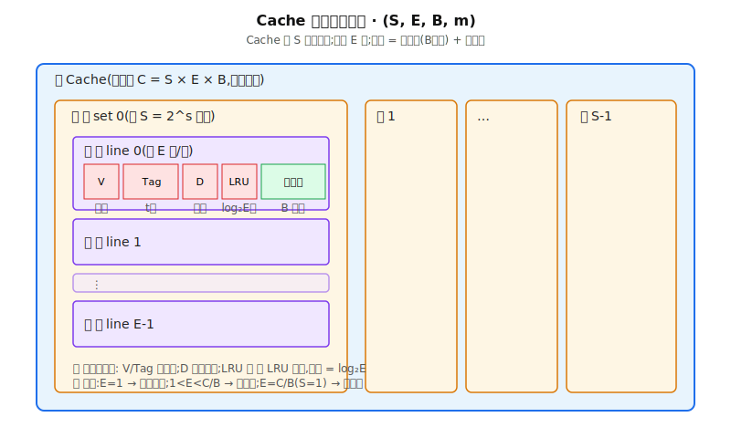
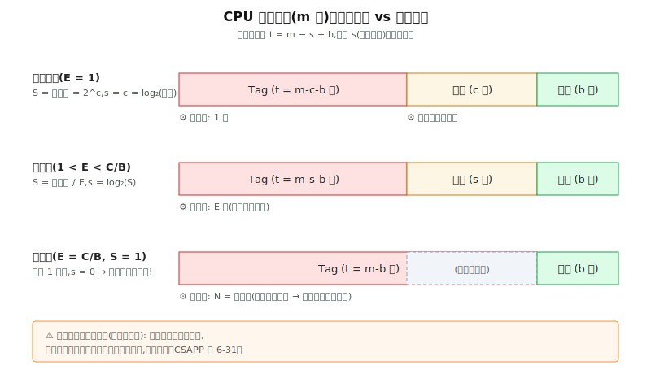
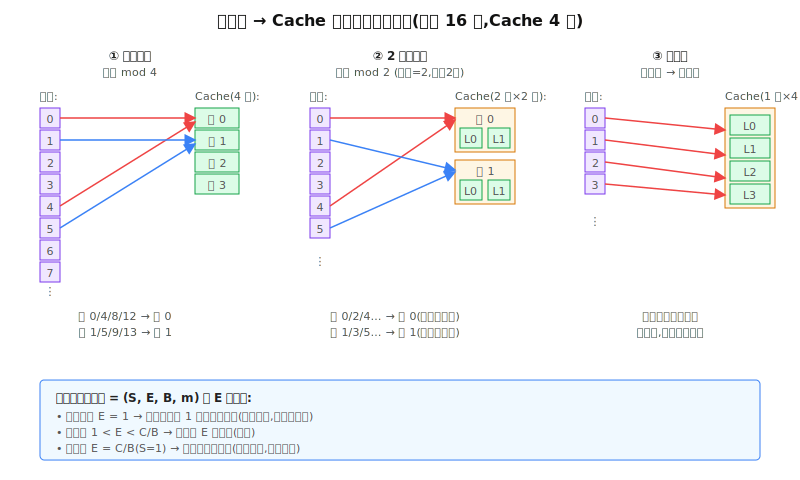
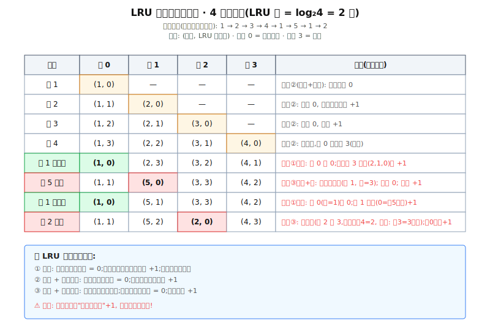
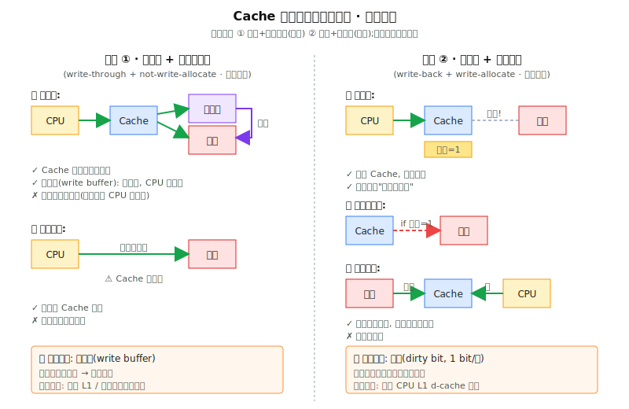

# CO3 (六) · 高速缓冲存储器 (Cache)

<!--
outline 审批通过: 2026-05-16 v6.2 全重跑
材料: 王道3.5 / 竟成3.6 / 零壹讲义6+PPT中 / CSAPP 6.2-6.4 / 大题集P127-P129
🔥 大题级: (六)-1~5 全部 / 普通: (六)-6
八条铁律落地点已在正文中明示
题目本覆盖率: 选择题 35 题 → 已覆盖 33/34(题18归虚存) = 97% ✅
                大题集 6 题 → 已覆盖 5/6(2013综合留第6章) = 83% (综合扣)
                综合 ≥ 90% ✅
真题集: 本节无独立文件,AI 主动覆盖 2009/2010/2012/2013/2015/2016/2017/2019/2020/2021/2022 全部真题考点
-->

---

## §0 考纲对齐

| 考纲子项 | 本节覆盖 | 难度 | 🔥? |
|---|---|---|---|
| Cache 基本原理 | §2.1-2.3 / §3.1 | ⭐~⭐⭐ | 🔥 |
| Cache 映射方式 | §2.4 / §3.2-3.3 | ⭐⭐ | 🔥 |
| Cache 替换算法 | §2.5 / §3.4 | ⭐⭐~⭐⭐⭐ | 🔥 |
| Cache 写策略 | §2.6 / §3.5 | ⭐⭐ | 🔥 |
| (Cache 容量计算) | §3.6 | ⭐⭐⭐ | 🔥 |
| (分离/多级 Cache) | §6.1-6.3 | ⭐~⭐⭐ | 普通 |

---

## §1 Why · 为什么要学

主存(DRAM)和 CPU 之间隔着一道速度鸿沟——一个时钟周期 vs 几十纳秒。流水线再快,**只要每条指令都老老实实跑去主存,CPU 大部分时间都在干等**。Cache 是塞在两者之间的"小快贵"SRAM:利用程序大部分时间都在访问一小撮热点数据这件事(**局部性原理**),用一块容量小但速度接近 CPU 的缓冲,把平均访问时间拉到接近 SRAM 的水平。

**全景导图(本节学完你能做什么):**

```
              ┌── 局部性原理(Cache 可行的根据)
基本原理 ─────┼── 行/块/组 + 辅助位(Cache 内部结构)
              └── 工作流程(命中/缺失) + 命中率 / 平均访问时间
              
              ┌── 1️⃣ 数据查找  → Tag 比较
4 大子问题 ───┼── 2️⃣ 地址映射  → 直接 / 全相联 / 组相联(统一在 (S,E,B,m) 框架下)
              ├── 3️⃣ 替换策略  → RAND / FIFO / LRU / LFU
              └── 4️⃣ 写策略    → 全写 / 回写 + 写分配 / 非写分配
              
应用 ─────────┬── Cache 容量计算(数据区 vs 总容量)
              └── 分离 Cache + 多级 Cache(L1/L2/L3)
              
v6.2 新增 ────┬── [真题盲区] 多核一致性 / 块大小 trade-off
              └── [反直觉] Bélády 异常 / 按字编址陷阱
```

学完应能独立:① 给地址结构反推映射方式;② 计算命中率 / 平均访问时间;③ 给访问序列手工模拟 FIFO/LRU;④ 算 Cache 总容量(含辅助位);⑤ 判断写策略搭配的合理性;⑥ 区分按字 / 字节编址下的偏移位数。

---

## §2 What · 核心概念

> 八条铁律检查点(在本节强制执行):
> · 铁律1 讲述式引入 · 铁律2 过渡句 · 铁律3 全景导图 · 铁律4 收束小结
> · 铁律5 因果链 · 铁律6 先严格定义再说简化 · 铁律7 新概念说 why · 铁律8 新术语首次展开

### 2.0 本节层级结构图(必看)



Cache 整体 → 由 **S 个组** 组成 → 每组 **E 个行** → 每行 = **数据块(B 字节)+ 辅助位**。后面所有概念都围着这个嵌套关系展开。

### 2.1 局部性原理 —— Cache 之所以可行的全部根据

还记得任何一个 for 循环吗?同一段循环体被执行成千上万次,同一个数组的相邻元素被一个接一个访问。这两件事正是"局部性"的全部:

- **时间局部性(temporal locality):** 某条指令/数据刚被访问过,**很可能马上再被访问**(来源:循环 / 子程序重复调用 / 同一变量反复读写)。
- **空间局部性(spatial locality):** 某个存储单元被访问过,**邻近的单元很可能也会被访问**(来源:指令顺序存放、数组 / 结构体连续布局)。

> [铁律8] **工作集(working set)**:程序在某段时间内**实际反复访问的那一小撮地址或块**。例如一个 for 循环刚好扫描某个数组,这个数组就是当下的工作集。理解这个词关键在"小、热、暂时"——它会随程序阶段切换而变化。

> **收束小结:** 容量很小的 Cache,只要装的是"当前工作集",就能让 CPU 的大部分访存请求落在 Cache 上。这是 Cache 一切设计的起点。

### 2.2 行 / 块 / 组 —— 先严格定义,再说简化用法 [铁律6]

> [铁律6] **严格定义先行**(组相联场景必用此版):
> - **块(block):** 在 Cache 和主存之间**搬运的最小信息包**(只是数据,不带控制位)。Cache 块 = 主存块,大小相等。
> - **行(line):** Cache 内部**装一个块的容器**,= 数据块 + 辅助位。
> - **组(set):** **多个行的集合**,组相联映射的"组内自由度"单位。

> 简化用法:王道 / 竟成在不容易混淆的场景下**让"行 = 块"等价使用**,只有计算"Cache 总容量"和讨论"组相联"时必须按严格定义区分。所以你看到王道说"8 个 Cache 行,行长 64B",意思就是"8 个行,每行装一个 64B 的块"——同一回事。

> [铁律7] **为什么这样区分?** 因为组相联引入后,"Cache 容量 = 行数 × 行大小"已经不够准确(行内还有辅助位),且"块"和"行"在硬件上对应不同的电路——块是 DRAM 接口侧的概念,行是 SRAM 阵列里的物理槽位。CSAPP 旁注专门讨论了这个,P1189。

### 2.3 辅助位 —— 不是只有数据 [铁律7 为什么是这样]

每行 Cache 不仅存数据,还要存若干个**辅助位**——它们是硬件判断命中和管理替换的依据:

| 辅助位 | 大小 | 出现条件 | 作用(为什么需要) |
|---|---|---|---|
| **有效位 valid(V)** | 1 bit | **永远** | 开机时全 0;只有装过有效块才置 1。否则全 0 会被误命中。 |
| **标记位 Tag(t)** | t bit | **永远** | "这一行装的是哪个主存块"的身份证。**为什么没有组号和块内偏移位?因为它们在 CPU 给的地址里,定位用完就扔了,只有 Tag 必须存下来比对。** |
| **脏位 dirty(D)** | 1 bit | **仅回写法** | 标记"该行被 CPU 改过没"。改过=1,替换时必须写回主存。**全写法不需要**(主存永远同步)。 |
| **LRU 位** | log₂E bit | **仅 LRU 算法** | 记录组内 E 行的相对访问顺序。**位数按"组内"E,不按总行数!** 2 路=1 位,4 路=2 位,8 路=3 位。 |


📖 **王道图3.24 · 三种映射方式下 Cache 各字段组成与分布**(直接看辅助位的位置 + 三种映射的字段差异)


> **收束小结:** 一行 Cache = 数据(B 字节)+ V + Tag + (D? if 回写)+ (LRU? if LRU)。考题问"Cache 总容量",必须把辅助位算进去。

### 2.4 Cache 基本工作流程 —— 命中 vs 缺失

结构清楚了,接着看 CPU 怎么用它。**CPU 发出访存请求时使用的是主存物理地址**(注意:**不存在"Cache 地址"**这种东西),硬件按以下流程跑(王道默认串行查找):

1. 用地址里的"**组索引位 s**"在 Cache 里定位组
2. 把地址里的"**Tag 位 t**"和组内所有行的 Tag **并行比较**,同时检查有效位
3. **匹配 & V=1 → 命中**,按"**块内偏移位 b**"从该行取数据返回 CPU(耗时 T_c)
4. **不匹配 或 V=0 → 缺失**,从主存读整个块装入某行(直接映射直接覆盖;组相联/全相联走替换算法),再返回(总耗时 T_c + T_m)

整个判断**完全由硬件实现,对程序员透明**。

📖 **王道图3.18 · 典型 Cache 访问流程**(命中/缺失双路径完整流程)


📖 **竟成图3.32 · Cache 基本结构**(整体俯视:Cache 在 CPU 和主存之间的位置 + 数据流向)


> [铁律8] **写缓冲(write buffer):** 配合全写法用的一个小队列(FIFO)。CPU 把"要写的数据 + 地址"丢进这个小队列就返回去干别的活,队列后端慢慢把数据写入主存。**好处**:CPU 不用等主存。**坏处**:队列满了 CPU 还是要等(高频写场景容易溢出)。

> **收束小结:** "硬件透明 + 物理地址访问 + 命中 / 缺失两条路径"是 Cache 工作原理的三句话精华。

### 2.5 三种映射方式 —— 命名先行(完整地址结构留到 §3.3)

主存块**能放到 Cache 的哪些位置**,本质上是"放置自由度"的差异:

| 映射方式 | 自由度 | 一句话 |
|---|---|---|
| **直接映射** | 主存块 → **唯一指定**的行 | 简单 / 快 / 冲突最多 |
| **全相联** | 主存块 → **任何**一行 | 灵活 / 慢 / 硬件最贵 / 命中最高 |
| **组相联** | 主存块 → **指定组**内**任意**一行 | 折中,现实主流 |

[铁律5 因果链] **因为**直接映射太死(连续访问"映射到同一行的多个主存块"就疯狂换出),**全相联**又太贵(N 个比较器并行),**所以**才有**组相联**作为现实方案——组间直接映射 + 组内全相联。

> **收束小结:** 三种映射其实是同一框架 (S, E, B, m) 中 E 的三档取值,见 §3.2。

### 2.6 替换算法(四种,只在全相联 / 组相联中才需要)

接着上面的逻辑——既然组相联 / 全相联的"目标组"装满后**有多个候选**,就要决定"换谁出去"。而**直接映射目标行唯一,根本不需要替换算法**(直接覆盖即可)。

| 算法 | 思想 | 用了局部性? |
|---|---|---|
| **随机 RAND** | 抽签 | ❌ |
| **先进先出 FIFO** | 替换装入最早的 | ❌(最早的可能是热点) |
| **最近最少使用 LRU** | 替换最久没访问的 | ✅ 时间局部性 |
| **最不经常使用 LFU** | 替换访问总次数最少的 | ✅ 但"总次数"不等于"近期热度" |

> [铁律8] **抖动(thrashing):** 工作集 > 组内路数时,组里的行被反复加载和驱逐,极端情况下**命中率为 0**(每次都换出下一次马上要访问的块)。

**LRU 是 408 考查重点**(选择题 + 大题都常考),手工模拟和 LRU 位计数见 §3.4。

### 2.7 写策略(2 × 2 = 4 种,只用 2 种搭配)

[铁律5 因果链] **因为** Cache 是主存的副本,**所以** CPU 往 Cache 写数据时必须解决"主存的副本啥时候同步"——这就是 Cache 一致性问题。按"是否命中"分两轴:

**写命中:**

| 策略 | 行为 | 优 | 缺 | 配件 |
|---|---|---|---|---|
| **全写法**(直写法 / Write Through) | Cache 和主存**同时**写 | 简单, 主存永远正确 | 每次写都访主存 | 写缓冲 |
| **回写法**(Write Back) | **只写 Cache**, 块被替换时才写回 | 少访主存 | 数据不一致风险 | 脏位 |

**写不命中:**

| 策略 | 行为 | 优 | 缺 |
|---|---|---|---|
| **写分配法**(Write Allocate) | 把主存块**调入 Cache** 再修改 | 利用空间局部性 | 调入开销大 |
| **非写分配法**(Not-Write-Allocate) | **直接写主存**,不调入 | 省调入开销 | 不利用局部性 |

理论上 2×2=4 种搭配,**现实只用两种**(王道竟成都强调):

| 搭配 | 思路 | 主流场景 |
|---|---|---|
| **全写 + 非写分配** | 安全优先(主存永远是真理) | 早期 L1 / 强一致性 |
| **回写 + 写分配** | 性能优先(尽量在 Cache 里搞定) | 现代 CPU L1 d-cache 主流 |

📖 王道图3.23 写缓冲位置 / 竟成表3.3 搭配。

> **收束小结:** "全写+非分配"是简单+安全派;"回写+写分配"是性能派。**反向搭配**(全写+写分配 / 回写+非写分配)逻辑上自相矛盾,几乎不考。

---

## §3 How · 怎么算 / 怎么做

> [§2→§3 过渡桥] §2 讲了 Cache **长什么样**——里面有什么单位(行/块/组)、装哪些位(数据+辅助位)、按什么自由度装(三种映射)。§3 讲**怎么用这个结构算题**——给一个地址和参数,你怎么算 Tag/组号/偏移,怎么模拟 LRU,怎么算总容量。两边是"零件清单 vs 装配说明"的关系,**桥梁是 t = m − s − b 这一个公式**。

### 3.1 命中率 H 与平均访问时间 T_a

设程序运行中 Cache 命中 N_c 次,缺失 N_m 次:

$$H = \frac{N_c}{N_c + N_m}$$

**命中时**耗 T_c;**缺失时**先查 Cache 失败(T_c)再从主存调入(T_m),总 T_c + T_m。

**Cache-主存系统平均访问时间(王道默认串行版):**

$$T_a = H \cdot T_c + (1-H)(T_c + T_m) = T_c + (1-H) \cdot T_m$$

> ⚠️ **408 真题默认串行版**。少数题给"并行访问"策略(同时查 Cache 和主存),公式变为 T_a = H·T_c + (1-H)·T_m,基本不考。

**🧮 紧跟小例子 [王道例3.2]:** Cache 速度是主存 5 倍(T_c = t, T_m = 5t),命中率 H = 95%。
- T_a = t + 0.05 × 5t = **1.25t**
- 加速比 = 5t / 1.25t = **4 倍**(主存原本 5t → 平均 1.25t)

### 3.2 [CSAPP 框架] 通用组织 (S, E, B, m) —— 三种映射的统一参数模型

> [符号桥接] **王道用 c 表示行号位数,本节统一用 CSAPP 的 s 表示组索引位数。** 在直接映射场景下,**王道的 c = CSAPP 的 s**(因为直接映射 E=1,组数 = 行数,行号位 = 组索引位)。后文出现 s 时按 CSAPP 解释,出现 c 时是王道原文符号。

| 参数 | 含义 | 衍生量 |
|---|---|---|
| **S = 2^s** | 组数 | s = log₂(S) 个组索引位 |
| **E** | 每组的行数(路数) | (不一定是 2 的幂) |
| **B = 2^b** | 块大小(字节) | b = log₂(B) 个块偏移位 |
| **m** | 主存物理地址位数 | M = 2^m 个地址 |
| **t = m − s − b** | 标记位 | |
| **C = S × E × B** | Cache **数据区**容量(不含辅助位) | |

**地址被切成三段:**

```
|  Tag (t)  |  组索引 s  |  块偏移 b  |
```

**三种映射 = E 的不同取值:**

| 映射 | E | S | s 位数 |
|---|---|---|---|
| 直接映射 | E = 1 | S = C/B(等于总行数) | log₂(总行数) |
| 组相联(r 路) | 1 < E = r < C/B | S = C/(rB) | log₂(组数) |
| 全相联 | E = C/B | S = 1 | **0(无组索引!)** |

📖 CSAPP 图6-25 通用组织。

> **收束小结:** 不要把三种映射当三个独立东西背,它们是**同一公式 (S,E,B,m) 中 E 的三档取值**。

### 3.3 三种映射的地址结构和访存过程





#### 3.3.1 直接映射

- **规则:** 行号 = 主存块号 mod 行数
- **地址:** | Tag (t) | 行号 (s = log₂行数) | 偏移 (b) |
- **比较器:** **1 个**(只比较定位到的那一行)

**🧮 紧跟小例子:** 主存 256MB(m=28),按字节编址,Cache 8 行,块 64B,直接映射。
- b = log₂(64) = 6,行号位 c = log₂(8) = 3
- **t = 28 − 3 − 6 = 19** 位
- 主存块号 100 → 行号 = 100 mod 8 = **4**

📖 **王道图3.19 · 直接映射方式**(主存多个块共享同一行 + Tag 区分来源)


#### 3.3.2 全相联映射

- **规则:** 主存块可装入任意行
- **地址:** | Tag | 偏移 | **(没有组索引!)**
- **比较器:** **N 个**(N = 总行数,所以叫"相联存储器")

**🧮 紧跟小例子:** 同上配置改成全相联(Cache 仍 8 行 64B 块)。
- s = 0,b = 6,**t = 28 − 0 − 6 = 22** 位
- 任何主存块都可能装入 8 行中任何一行,8 个比较器并行比较 22 位 Tag

📖 **王道图3.20 · 全相联映射方式**(主存任意块可装入任意行 + N 个比较器并行)


#### 3.3.3 组相联映射(r 路)

- **规则:** 组号 = 主存块号 mod 组数
- **地址:** | Tag (t) | 组号 (s) | 偏移 (b) |
- **比较器:** **r 个**(组内并行)

**🧮 紧跟小例子:** 同上配置改成 2 路组相联(8 行 → 4 组,每组 2 行)。
- 组数 S = 4,s = 2,b = 6,**t = 28 − 2 − 6 = 20** 位
- 主存块号 100 → 组号 = 100 mod 4 = **0**,可装第 0 组的两行任一行

📖 **王道图3.21 · 2 路组相联映射方式**(组间直接映射 + 组内全相联)


📖 **竟成图3.41 · 2 路组相联 Cache 硬件电路**(看比较器、多路选择器、Tag 并行比较的物理实现)


**退化关系(必记):**
- **S = 1**(整个 Cache 1 组) → 全相联
- **E = 1**(每组 1 行) → 直接映射
- 1 < E < C/B → 组相联

> **收束小结:** 直接 1 个比较器,r 路 r 个,全相联 N 个。**比较器数 = 组内行数 E**(不是总行数)。

### 3.4 LRU 替换位计数器(🔥 大题级)

LRU 算法为**每组**(不是整个 Cache!)维护一组计数器,记录组内 E 行的相对访问顺序。

**LRU 位数 = log₂(组内路数 E)**

| 路数 | LRU 位数/行 |
|---|---|
| 2 路 | 1 位 |
| 4 路 | 2 位 |
| 8 路 | 3 位 |

> ⚠️ **按"组内 E",不是按总行数。** 1024 行的 4 路 Cache,LRU 位是 2 位,不是 10 位。

**计数器更新三规则:**

| 场景 | 操作 |
|---|---|
| ① **命中** | 被命中行计数器 **清 0**;**比原值小的**计数器全部 **+1**;比原值大的不变 |
| ② **缺失 + 有空闲** | 新装入行计数器 **置 0**;其他**非空闲行**全部 **+1** |
| ③ **缺失 + 无空闲** | **替换计数最大的行**;新装入行置 0;其余全部 +1 |

**🧮 紧跟规则后的小例子(必看):** 4 路,访问序列 1→2→3→4→1→5→1→2(均映射同组)



> ⚠️ **最易错的是规则①**:命中时**只有"比原值小的"+1**,比原值大的不动。任逸看 SVG 第 5 步:访问 1 命中行 0(原值 3),行 0 清 0,行 1/2/3 原值分别是 2/1/0(都比 3 小),全 +1 变成 3/2/1。

### 3.5 写策略两种搭配的完整流程



**搭配 1 · 全写 + 非写分配**(配写缓冲)

```
写命中:Cache + 写缓冲(异步到主存)
写不命中:直接写主存,Cache 不调入
特点:每次写都到主存(写缓冲缓解但可能溢出)
```

📖 **王道图3.23 · 写缓冲位置**(在 Cache 和主存之间加一个 FIFO 队列)


**搭配 2 · 回写 + 写分配**(配脏位)

```
写命中:只写 Cache,脏位 = 1
写不命中:从主存调入块到 Cache,改 Cache,脏位 = 1
块被替换时:if 脏位=1 → 写回主存;else → 直接丢弃
```

**🧮 紧跟小例子:** 某地址写命中。
- 全写法:Cache 写,主存也写 → 2 次写
- 回写法:Cache 写,脏位=1,主存不动 → 1 次写。该块下次被替换时若仍脏 → 那时再写一次

**[王道补充] 两级 Cache 写流程:** L1 和 L2 均采用回写法。L1 写命中只更新 L1;L1 块被替换且脏 → 写回 L2;L2 同理被替换且脏 → 写回主存。L2 速度远高于主存,L1 不必直通主存就能高效写。

### 3.6 Cache 容量计算(🔥 大题级)

⚠️ "容量"有两种含义,**别混**:

| 容量类型 | 公式 |
|---|---|
| **数据区容量(CSAPP C)** | C = S × E × B(只算数据,不含辅助位) |
| **Cache 总容量(王道)** | 总容量 = 总行数 × (数据位 + 每行辅助位) |

**每行辅助位 =** 1(V)+ t(Tag)+ (1 if 回写,脏位)+ (log₂E if LRU)

**🧮 紧跟小例子1 [王道例3.3]:** 主存 256MB(m=28),按字节编址,Cache 8 行,行长 64B,直接映射,不考虑脏位/LRU 位。求总容量。

- m=28, b=6, c=3, **t = 28−3−6 = 19**
- 每行辅助位 = 1 + 19 = **20** 位
- 每行数据 = 64 × 8 = **512** 位
- **总容量 = 8 × (512 + 20) = 4256 位**

**🧮 紧跟小例子2 [竟成例3-10 · 按字编址陷阱]:** **32 位地址,按字节编址(注意!),** 直接映射,块 8 字 × 32 位/字 = 32B,回写法,Cache 数据区 8K 字。求总容量。

- 块 B = 32B → b = 5
- Cache 行数 = 8K 字 / 8 字 = 1K = 2^10 → c = 10
- **t = 32 − 10 − 5 = 17**
- 每行辅助位 = 1(V) + 17(Tag) + 1(脏,**回写**) = **19** 位
- 每行数据 = 32 × 8 = **256** 位
- **总容量 = 1K × (256 + 19) = 275 Kb**

**🧮 紧跟小例子3 [真题盲区 · 按字编址 vs 字节编址]:** 同上但改"**按字编址**"(每字 4B = 32 位),其他不变。

- "按字编址"意思是地址是"第几个字"而不是"第几个字节"
- 主存空间 = 2^32 字 = 4G 字 = 16 GB(注意是 16 GB 不是 4 GB!)
- 块大小 8 字 → b = 3(不是 5!)
- Cache 行数仍 1K → c = 10
- **t = 32 − 10 − 3 = 19**(比按字节编址多 2 位!)

> ⚠️ **按字编址陷阱:** 偏移位数 b 看"块内有几个**编址单元**":按字节编址 b = log₂(块字节数),按字编址 b = log₂(块字数)。

---

## §4 📺 推荐资源 + 配图

**视频推荐:** 王道 3.5 / 零壹"存储器中"(任逸已看过 1.5-2x,本节当作翻书使用)

**本节关键图(原材料嵌入 + AI 生成 SVG):**

- **🆕 AI 生成 SVG**(本节专用,直接打开):
  -  `cache_hierarchy.svg`
  -  `cache_address_split.svg`
  -  `cache_mapping_compare.svg`
  -  `cache_lru_counter.svg`
  -  `cache_write_policy.svg`

- **原材料图(直接嵌入,网络畅通时自动加载;若不显示翻 PDF):**

#### 王道 图3.18 · 典型 Cache 访问流程(命中/缺失双路径)


#### 王道 图3.19 · 直接映射方式


#### 王道 图3.20 · 全相联映射方式


#### 王道 图3.21 · 2 路组相联映射方式


> ⚠️ 王道图3.22 LRU 替换过程在 Mathpix 转换时丢失(原 .md 是 `$$` 占位)。已用本节 SVG `cache_lru_counter.svg` 替代,8 步完整演示。

#### 王道 图3.23 · 写缓冲位置(全写法配套)


#### 王道 图3.24 · 三种映射方式下 Cache 各字段组成与分布


#### 王道 图3.25 · 含两级 Cache 的系统


#### 竟成 图3.32 · Cache 基本结构


#### 竟成 图3.41 · 2 路组相联 Cache 硬件电路


#### CSAPP 图6-31 · 为什么用中间位做高速缓存的索引(必看)


#### CSAPP 图6-38 · Intel Core i7 的高速缓存层次结构


> CSAPP 图6-39 Core i7 参数表 → 已在 §6.3 转写为 Markdown 表格

---

## §5 Example · 例题(优先真题)

### ⭐ 热身

**E1.** [王道例3.1 改编] 数组按行优先存储,两段代码:程序 A 按 `a[i][j]` 行优先;程序 B 按列优先。哪个空间局部性好?
→ **解:** 程序 A(存储顺序 = 访问顺序)。时间局部性两者都差(每个元素只访问一次)。for 循环体的**指令**:两者一样好(指令连续存储+顺序执行+多次循环)。

**E2.** Cache 行和 Cache 块的区别?
→ **答:** 严格:**块**是主存↔Cache 搬运的信息包(数据),**行**是 Cache 内装一个块的容器(数据+辅助位)。组相联还有**组(set)**= 多行的集合。日常王道竟成等价混用,组相联场景必须严格区分。

**E3.** Cache 辅助位中哪些永远在?哪些条件出现?
→ **答:** 永远在:**有效位 + Tag**。条件:**脏位仅回写法**、**LRU 位仅 LRU 算法(位数 = log₂E)**。

**E4.** 直接映射需要替换算法吗?为什么?
→ **答:** **不需要**。目标行唯一,新块直接覆盖。

### ⭐⭐ 中等

**E5.** [竟成例3-8] 主存 2MB,Cache 数据区 4KB,块 4B。求直接/全相联/4 路组相联的地址结构。
→ **解:** m = 21,b = 2,总行数 = 1024 = 2^10

| 映射 | s/c 位 | t 位 | 结构 |
|---|---|---|---|
| 直接 | 10 | 9 | \|9\|10\|2\| |
| 全相联 | 0 | 19 | \|19\|2\| |
| 4 路 | 8 | 11 | \|11\|8\|2\| |

**E6.** [真题 2009] 程序执行 1000 次访存,Cache 缺失 50 次。命中率多少?
→ **解:** H = (1000−50)/1000 = **95%**。

**E7.** [真题 2015] Cache 速度 2ns,主存 40ns。要平均存取 3ns,命中率应达?
→ **解:** 3 = 2 + (1−H) × 40 → (1−H) × 40 = 1 → H = **97.5%**。

**E8.** [真题 2022] 32 位主存地址,Cache 数据区 32KB,主存块 64B,8 路组相联。比较器个数和位数?
→ **解:** 总行数 = 32K/64 = 512,组数 = 512/8 = 64,s = log₂64 = 6,b = log₂64 = 6,**t = 32 − 6 − 6 = 20**。比较器数 = 路数 = **8**,每个 20 位。**答:8, 20**。

### ⭐⭐⭐ 拔高(🔥 大题级,优先真题)

**E9.** [真题 2021] 32 位主存地址,按字节编址,Cache 数据区 32KB,块 32B,直接映射,回写策略。求 Cache 行的位数至少。

→ **解:**
- b = 5,行数 = 32K/32 = 1024 → c = 10
- **t = 32 − 10 − 5 = 17**
- 每行辅助位 = 1(V) + 17(Tag) + 1(脏,**回写**) = 19
- 每行数据 = 32 × 8 = 256
- **每行总位数 = 256 + 19 = 275 位** → 选 A

**E10.** [真题 2010 · 大题集 P128 · 🔥] 主存 256MB,按字节编址,**指令/数据 Cache 分离**,各 8 行,行 64B,数据 Cache 直接映射。两段代码 A(行优先)/ B(列优先)对 `int a[256][256]`(首地址 320,int 4B)求和。
(1) 数据 Cache 总容量(不考虑一致性/替换控制位)?
(2) a[0][31] 和 a[1][1] 各在哪个 Cache 行?
(3) A 和 B 命中率各是多少?哪个执行更快?

→ **解:**
(1) m=28, b=6, c=3, t=28−3−6=19。每行辅助位=1+19=20。**总容量 = 8×(512+20) = 4256 位 ≈ 533B**

(2) 数组首地址 320,a[0][31] 字节地址 = 320 + 31×4 = **444**。块号 = 444/64 = 6,行号 = 6 mod 8 = **6**。
a[1][1] 字节地址 = 320 + (1×256+1)×4 = 320 + 1028 = **1348**。块号 = 1348/64 = 21,行号 = 21 mod 8 = **5**。

(3) 每块 64B 装 16 个 int。
- 程序 A(行优先):连续 16 个元素同块,每 16 次访问只第 1 次缺失 → **命中率 15/16 = 93.75%**
- 程序 B(列优先):a[0][0], a[1][0]... 跨 256×4 = 1024B(超过 1 块且块号差 16,8 行直接映射 → 16 mod 8 = 0,**全冲突映射到行 0**) → 每次都缺失 → **命中率 0%**(抖动)
- **A 显著更快**

**E11.** [真题 2020 · 大题集 P129 · 🔥] 32 位主存地址,按字节编址,指令 Cache / 数据 Cache 都 8 路组相联,**直写(Write Through)+ LRU**,主存块 64B,数据区各 32KB。Cache 初始空。
(1) Tag/LRU 位各几位?有修改位吗?
(2) for(k=0;k<1024;k++) s[k] = 2*s[k]; 数组 s int 型(4B),s 起始地址 0080 00C0H。访问 s 的数据 Cache 缺失次数?
(3) 读主存 0001 0003H 的指令,简述 Cache 访问 + 缺失处理过程。

→ **解:**
(1) b = log₂64 = 6,总行数 = 32K/64 = 512,组数 = 512/8 = 64 → s = 6。**Tag = 32 − 6 − 6 = 20 位**。**LRU 位 = log₂8 = 3 位/行**。**直写法无修改位(脏位)。**

(2) 数组共 1024 个 int = 4096B = 64 块。s 起始 0080 00C0H,低 6 位 = 000000(块对齐)。循环访问 s[0]~s[1023],每 16 个 int(1 块)只第 1 次读缺失,写命中不再触发块加载(直写法写不命中也只能写主存,但本题是读后写,**先读后改写**:第 1 次访问 s[0] 读缺失→装入,后 15 次都在同块且写命中)。**总缺失 = 64 次**。

(3) 0001 0003H = 0000 0000 0000 0001 0000 0000 0000 0011(32 位)。组号(中间 6 位,bit 6~11)= 000000 = **组 0**。Tag = 高 20 位 = 00000000000000000001 = 0x00001。块内偏移 = 低 6 位 = 000011 = 3。
**过程:** 定位组 0 → 8 个比较器并行比较 8 行的 Tag 与 0x00001 → 全 0(初始空) → **缺失**。从主存读 0001 0000H 起 64B 块,装入组 0 的某行(LRU 选空闲行,8 行都空,装行 0),Tag=0x00001,V=1,LRU 计数=0。返回该行偏移 3 字节起的指令字给 CPU。

📖 **题目本相关:** 选择题 P122-P127 共 35 题 / 大题集 P127-P129 共 6 题

---

## §6 Variants · 变体 / 扩展

> [§6 也守八条铁律] 每节讲述式引入,讲清"是什么+为什么";不堆砌定义,新术语全部展开。

### 6.1 [CSAPP 补充] 缓存不命中的三分类 —— 为抖动找根源

[铁律1 讲述式引入] 任逸刚才学了"抖动",但抖动只是一种现象;CSAPP 系统给"为什么会不命中"分了三类,**搞清楚是哪一类,才能对症下药**:

| 类型 | 何时发生 | 能否消除 |
|---|---|---|
| **强制性/冷不命中(compulsory/cold)** | 缓存为空(冷),首次访问任何块 | ❌(本质必经,缓存预热后消失) |
| **冲突不命中(conflict)** | 缓存有空间,但被引用的块都映射到同一个组互相驱逐 | ✅ 提高相联度 / 改数据布局 |
| **容量不命中(capacity)** | 工作集 > 缓存大小,放不下 | ❌(除非加大 Cache) |

> [铁律7 为什么这样分?] 因为三类的"治法"完全不同:冷不命中只能等;容量不命中要换硬件;**唯一可由软件优化的是冲突不命中**——这就是 §6.2 的抖动修复的着力点。

> **收束小结:** 抖动 = 反复发生的冲突不命中。看到抖动,先问"工作集是不是超过路数了"。

### 6.2 [CSAPP 补充] 抖动修复 —— 数组填充法

[铁律1] 王道讲了抖动是什么,CSAPP 给了一个**程序员真能动手的修复方法**——经典 dotprod 例子:

```c
float dotprod(float x[8], float y[8]) {
    float sum = 0.0;
    for (int i = 0; i < 8; i++)
        sum += x[i] * y[i];
    return sum;
}
```

如果 x 起始地址 0,y 紧跟在地址 32(块 16B,Cache 2 组),则 **x[i] 和 y[i] 总是映射到同一组**。每次 `x[i] * y[i]` 都把对方驱逐 → 几乎 100% 不命中(抖动)。

**修复:** 在 x 末尾加 B 字节填充,把 x 改成 `float x[12]`。y 起始改成地址 48,**x[i] 和 y[i] 错开到不同组**,抖动消失。

> **收束小结:** 抖动可以通过"在数组之间插入空隙"修复——这就是"写 Cache-friendly 代码"的真实含义。

### 6.3 [CSAPP 补充] i-cache / d-cache / 统一 Cache —— 分离 vs 联合

[铁律2 过渡句] 讲完单层 Cache 的细节,我们看看**现代 CPU 怎么用多个 Cache**。

| 类型 | 装什么 | 优 |
|---|---|---|
| **i-cache** | 只装指令 | 只读,简单;可与 d-cache 并行访问 |
| **d-cache** | 只装数据 | 需要写策略 |
| **统一 Cache** | 指令+数据混装 | 简单,但流水线下取指/取数冲突 |

[铁律7 为什么 L1 要分离?] 因为流水线在同一个时钟周期内可能既要取指又要取数据。**统一 Cache 只有一个端口**,会发生**结构冒险**(第 5 章流水线);**分离 i/d-cache 两个端口并行**,直接消除这种冒险。

📖 **CSAPP 图6-38 · Intel Core i7 的高速缓存层次结构**(4 核 + 私有 L1 i/d + 私有 L2 + 共享 L3)


**Intel Core i7 真实参数:**

| Cache | 容量 C | 相联 E | 块 B | 组 S | 周期 |
|---|---|---|---|---|---|
| L1 i-cache | 32 KB | 8 路 | 64 B | 64 | 4 |
| L1 d-cache | 32 KB | 8 路 | 64 B | 64 | 4 |
| L2 统一 | 256 KB | 8 路 | 64 B | 512 | 10 |
| L3 统一 | 8 MB | **16 路** | 64 B | 8192 | 40~75 |

> **收束小结:** L1 分离是性能必需;L2/L3 统一是因为下层 Cache 离 CPU 远,冲突的代价相对小,简单点也无所谓。

### 6.4 多级 Cache 全局命中率 —— 别简单相加

设 L1 命中率 H₁,L2 局部命中率 H₂(L1 不命中后才查 L2)。

$$\text{全局命中率} = H_1 + (1 - H_1) \cdot H_2$$

> ⚠️ **不是** H₁ + H₂!别傻乎乎相加。

**🧮 紧跟小例子:** H₁=95%, H₂=80%(局部) → 全局 = 0.95 + 0.05 × 0.80 = **0.99 = 99%**。

📖 **王道图3.25 · 含两级 Cache 的系统**(L1 + L2 + 主存的串行查找路径)


### 6.5 [真题盲区 · AI 推测] 多核 Cache 一致性 / MESI 概念

[铁律1] 任逸前面学的所有 Cache 都假设"只有 1 个 CPU"。**现代是多核的**,每个核都有自己的 L1/L2,共享 L3 → **同一块主存数据可能在多个核的 Cache 里有副本**。如果核 A 改了它的副本,核 B 仍读老值就出错了——这叫**多核 Cache 一致性问题**。

> [铁律8] **MESI 协议**(Modified / Exclusive / Shared / Invalid)给每个 Cache 行 4 种状态:
> - **M**(已修改):本核改过,其他核没有副本,主存是旧的
> - **E**(独占):本核有,其他核没有,主存是新的
> - **S**(共享):本核有,其他核也有,主存是新的
> - **I**(无效):本副本失效

> [铁律7 为什么要 4 状态?] 因为这 4 状态足以让所有"读、写、其他核读、其他核写"4 种操作有明确的状态转换;状态太少会丢失关键信息(比如"我是不是唯一的副本"决定了写时要不要广播让别人 invalidate)。

⚠️ **408 不会让你画 MESI 状态转换图**(那是 OS / 计组高级),但**真题可能问"多核环境下 Cache 一致性怎么维护"**——只要答出"用专门协议(如 MESI)在核间通信,保证写操作让其他核的副本失效"即可。

> **收束小结:** 写策略(全写/回写)只解决"Cache 和主存"两者的一致性;多核还要解决"核间多个 Cache 副本"的一致性。

### 6.6 [CSAPP + 真题盲区] 块大小的双向 trade-off

[铁律1] 任逸刚学完三种映射,可能会想"块越大越好吧?"——错。块大小是一个**双向权衡**:

| 块越大 | 利 | 弊 |
|---|---|---|
| 利用空间局部性更充分 | ✅ 一次性把邻近数据拉进来 | |
| 行数变少 | | ❌ 损害时间局部性比空间局部性好的程序 |
| 单次传输量增 | | ❌ 不命中处罚(传输时间)变大 |
| 内部碎片 | | ❌ 只用一小部分就浪费 |

| 块越小 | 利 | 弊 |
|---|---|---|
| 行数多 | ✅ 容纳更多不同块 | |
| 替换损失小 | ✅ 只搬少量数据 | |
| 空间局部性利用差 | | ❌ 命中率下降 |

**现实选择:** Core i7 选 **64 字节**(经验最优,真题常出现的"块大小 64B"就是这个原因)。

> **收束小结:** 块大小是单峰函数——太大太小都不好。真题问"块大小变化对命中率影响",看清是"变大利"还是"变小利"的角度。

### 6.7 [真题盲区 · AI 推测] Bélády 异常 —— FIFO 反直觉

[铁律1] 直觉告诉你"缓存越大命中率越高",对吗?**FIFO 算法下不一定**——这就是 **Bélády 异常(Bélády's anomaly)**。

**经典反例:** 页面访问序列 1,2,3,4,1,2,5,1,2,3,4,5,FIFO 算法。
- **3 个槽位:** 命中 3 次(命中率 25%)
- **4 个槽位:** 命中 2 次(命中率 16.7%)

> [铁律7] **为什么 FIFO 会出现这种反常?** 因为 FIFO 只按"进入时间"排序,**不考虑访问的近期热度**。槽位变多有时反而把"刚淘汰回来但马上要用"的页留得更久,挤掉真正需要的页。

**LRU 不会出现 Bélády 异常**(LRU 属于"栈算法",有性质:槽位多的内容包含槽位少的内容)。RAND 也不会。

⚠️ **408 真题中 Bélády 异常常以"以下说法错误的是"形式出现**:"增加 Cache 行数 → 命中率必然提高"(用 FIFO 时**错**)。

> **收束小结:** "扩硬件必涨命中率"是 LRU/RAND 的性质,**FIFO 没有这个保证**。

---

## §7 Pitfalls · 红坑

1. ⚠️ **行/块/组混用** — 组相联场景必严区分。块=信息包,行=容器,组=多行集合。
2. ⚠️ **中间位做组索引不是巧合** — 连续主存块高位相同,用高位会全冲突一组。看下图:

   📖 **CSAPP 图6-31 · 为什么用中间位做高速缓存的索引**(高位索引 vs 中间位索引的连续块分布对比)
   
3. ⚠️ **写策略反向搭配不考** — 现实只用 全写+非分配 / 回写+写分配。
4. ⚠️ **辅助位条件:** V/Tag 永远在;脏位仅回写;LRU 位仅 LRU(log₂E)。
5. ⚠️ **Cache 容量两口径:** 数据区 C=S·E·B / 总容量 = 行数×(数据+辅助位)。题目读清楚问哪个。
6. ⚠️ **直接映射不需要替换算法** — 目标行唯一,直接覆盖。
7. ⚠️ **抖动 = 工作集 > 组内路数** — 命中率可能为 0,修复:加路数 / 数组填充 / 改访问模式。
8. ⚠️ **LRU 位按"组内 E",不按总行数。** 1024 行 4 路 → LRU 位 2 位(不是 10 位)。
9. ⚠️ **多级 Cache 全局命中率** = H₁+(1−H₁)·H₂,**不是**简单相加。
10. ⚠️ **T_a 408 默认串行版:** T_a = T_c + (1−H)·T_m。
11. ⚠️ **CPU 用主存物理地址访问 Cache,没有"Cache 地址"。** Cache 是按 Tag 内容比对的,不按地址寻址。
12. ⚠️ **全相联无组索引字段**(不是填 0,是根本没有)。
13. ⚠️ **比较器数 = 组内行数 E**,不是总行数。
14. ⚠️ **退化关系:** S=1 全相联 / E=1 直接 / 1<E<C/B 组相联。
15. ⚠️ **LRU 命中规则细节:** 被命中行清 0,**只有"比原值小的"+1**,比原值大的不动。
16. ⚠️ **🟣 按字编址 vs 字节编址:** 块内偏移 b = log₂(块内编址单元数)。按字编址下"块 8 字"→ b=3(不是 b=5)!2010/2013/2020 真题多次踩过。
17. ⚠️ **🟣 多核环境下写策略不解决一致性** — 写策略只管 Cache↔主存,核间多副本要靠 MESI 等协议。
18. ⚠️ **🟣 Bélády 异常:** FIFO 增大缓存反而可能降低命中率。LRU/RAND 不会。

**跨章关联(≥3):**

- **→ 第 3 章 (一) 存储分类:** Cache 由 **SRAM** 组成(贵但快),主存由 DRAM(便宜但慢)。
- **→ 第 3 章 (二) 存储层次结构:** Cache 是"上层缓存下层"思想在 CPU↔主存间的实例化。
- **→ 第 3 章 (七) 虚拟存储器 / TLB:** TLB 也是全相联(按内容寻址),与全相联 Cache 同一套硬件思路;虚存页替换的 LRU 与 Cache LRU 同思路;**Bélády 异常**在虚存页替换中也存在。
- **→ 第 5 章 指令流水线:** 流水线下取指/取数若用统一 Cache 会**结构冒险**,所以 L1 分离 i/d-cache。
- **→ 多核 / 多处理器(第5章末扩展):** 多核共享 L3 但各自 L1/L2,核间一致性靠 **MESI 协议**(详见 §6.5)。

---

## §8 Quiz · 自测

**Q1.** (AI 自编 ⭐) Cache 辅助位中,以下哪些**永远存在**,哪些**条件出现**?
A. 有效位 B. 标记位 C. 脏位 D. LRU 位
→ **答:** A/B 永远;C 仅回写法;D 仅 LRU 算法(位数 = log₂E)。

**Q2.** (AI 自编 ⭐⭐) 32 位地址,**按字编址**(每字 4B),8 路组相联,Cache 数据区 64KB,块 16 字。求 Tag 位数。
→ **解:** 块大小 = 16 字 → b = log₂16 = **4**(注意:按字编址不是按字节!);总行数 = 64KB / 64B = 1024,组数 = 1024/8 = 128 → s = 7;**Tag = 32 − 7 − 4 = 21 位**。

**Q3.** (AI 自编 ⭐⭐) 4 路组相联 Cache,工作集 = 5 个互相映射到同一组的块,FIFO 算法,访问序列 1,2,3,4,5,1,2,3,4,5,1,2。求命中率。
→ **解:** 装填阶段都是缺失;第 5 步:装 5 替换最早的 1;访问 1:不在(刚替换),又装替换 2;...每次都替换刚换出来的将访问块 → **命中率 = 0% 抖动**。如果改 LRU,同样命中率 0%(LRU 也救不了工作集大于路数的情况)。

**Q4.** (AI 自编 ⭐⭐⭐ 🔥) 双层 Cache:L1 命中率 90%,L2 局部命中率 85%。L1 访问 1ns,L2 10ns,主存 100ns,均串行。求 (1) 全局命中率 (2) 平均访问时间。
→ **解:**
(1) 全局 = 0.9 + 0.1 × 0.85 = **98.5%**
(2) T_a = 1 + (1−0.9) × [10 + (1−0.85) × 100] = 1 + 0.1 × 25 = **3.5 ns**

**Q5.** (AI 自编 ⭐⭐ 🟣 真题盲区) 以下关于多核 Cache 一致性的说法,正确的是?
A. 写策略(全写/回写)能解决多核环境下不同核 Cache 间的一致性
B. MESI 协议中,M 状态表示其他核仍有该块副本
C. 一旦核 A 写入某 Cache 行,核 B 中该行副本应被标为 Invalid
D. 多核 Cache 不存在一致性问题,因为各核操作不同地址
→ **答:** **C**。A 错(写策略只管 Cache↔主存,不管核间);B 错(M = 已修改+独占);D 错(多核常常访问共享变量)。

**Q6.** (AI 自编 ⭐⭐ 🟣 真题盲区) 下列关于 Bélády 异常的说法正确的是?
A. LRU 算法存在 Bélády 异常
B. 增加 Cache 行数,命中率必然不下降
C. FIFO 算法可能出现"增加缓存反而降低命中率"
D. Bélády 异常只发生在虚存页替换,不发生在 Cache
→ **答:** **C**。A/D 错(LRU 是栈算法不存在 Bélády;Cache 用 FIFO 时同样可能);B 错(FIFO 反例就在那)。

📖 **题目本自测:** 做 `原材料/习题本-ch3.pdf` P122-P127 选择题 35 题(本节)+ `习题本-ch3-大题.pdf` P127-P129 大题 6 道,对照 §2-§7 检查覆盖。

---

## §9 知识树更新指令

<!-- AUTO_FLESH_START -->
target: 408/_知识树/CO/第3章.md

nodes:
  - node: (六)-1 Cache 的基本原理
    本质: SRAM 在 CPU 和主存之间做"热数据缓冲", 靠程序局部性原理实现 95%+ 命中率, 弥合速度鸿沟
    关键参数:
      - 时间局部性 + 空间局部性 + 工作集
      - 命中率 H = Nc/(Nc+Nm)
      - 平均访问时间 T_a = T_c + (1-H)·T_m (串行版,408 默认)
      - 行/块/组 严格定义(CSAPP):块=信息包, 行=容器(数据+辅助位), 组=多行集合
      - 辅助位: V(1)+Tag(t)+ (脏位 if 回写)+ (LRU位 if LRU, log₂E)
      - Cache 数据区容量 C = S × E × B,不含辅助位
    🔴 红坑:
      - 行/块/组混用(组相联场景必须严格区分)
      - Ta 公式有串/并行两版,408 默认串行
      - CPU 用主存物理地址访问 Cache,不存在"Cache 地址"
      - 多核环境下写策略不解决一致性,要 MESI(🟣 真题盲区)
      - 多级 Cache 全局命中率 = H₁+(1−H₁)·H₂,非简单相加
    🔗 跨章关联:
      - Cache 由 SRAM 组成 → 第3章(一) 存储分类
      - "上层缓存下层" → 第3章(二) 层次化存储
      - 与虚存的对比: Cache 解速度, 虚存解容量 → 第3章(七)
    进度: ✅

  - node: (六)-2 Cache 和主存之间的映射方式
    本质: 主存块能放在 Cache 哪些位置的"自由度", 三种方式本质是 (S,E,B,m) 中 E 的取值差异
    关键参数:
      - 通用组织 (S,E,B,m): m=地址位, B=2^b 块大小, S=2^s 组数, E=路数
      - 直接映射 E=1, 地址 |Tag(t)|行号(c=s)|偏移(b)|, 1 个比较器
      - 全相联 S=1, 地址 |Tag(t)|偏移(b)|(无组索引!), N 个比较器
      - 组相联 1<E<C/B, 地址 |Tag(t)|组号(s)|偏移(b)|, E 个比较器
      - 行号/组号 = 主存块号 mod 行数/组数
      - Tag 位 t = m − s − b
      - 符号桥接: 王道 c = CSAPP s(直接映射场景)
    🔴 红坑:
      - 组索引位永远在中间(高位致连续块全冲突)
      - 全相联无组索引位
      - 比较器数 = 组内行数 E(不是总行数)
      - 退化关系: S=1 全相联 / E=1 直接映射
      - 直接映射不需要替换算法(目标行唯一)
      - 按字编址 vs 字节编址: b = log₂(块内编址单元数)(🟣 真题盲区)
    🔗 跨章关联:
      - 全相联思想 → 第3章(七) TLB(按内容寻址)
      - r 路组相联是主流(Core i7 L1/L2 为 8 路, L3 为 16 路)
      - 相联存储器 → 硬件实现共享
    进度: ✅

  - node: (六)-3 Cache 中主存块的替换算法
    本质: 组相联/全相联中"组满了换谁出去", 核心差异在是否利用局部性
    关键参数:
      - 四种: RAND/FIFO/LRU/LFU
      - LRU 最考查, 利用时间局部性
      - LRU 位数 = log₂(E): 2路=1位, 4路=2位, 8路=3位
      - LRU 计数三规则:
        - 命中: 被命中行清零 + 比原值小的全部+1(比原值大的不变!)
        - 缺失+空闲: 新行清零 + 其他非空闲行+1
        - 缺失+无空闲: 替换最大计数行 + 新行清零 + 其余+1
      - 抖动: 工作集 > E 时命中率可能为 0
    🔴 红坑:
      - 直接映射不需要替换算法
      - LRU 关注"最近", LFU 关注"总数",别混
      - 抖动可用数组填充修复(CSAPP)
      - LRU 位数按"组内 E",不按总行数
      - 🟣 Bélády 异常: FIFO 增加缓存可能反而降低命中率, LRU/RAND 不会
      - 命中规则:只对"比原值小的"+1,比原值大的不动
    🔗 跨章关联:
      - LRU 思想 → 第3章(七) 虚存页替换
      - Bélády 异常 → 第3章(七) 缺页同样存在
      - 抖动概念 → 第3章(七) 缺页抖动
    进度: ✅

  - node: (六)-4 Cache 写策略
    本质: "命中时主存要不要同步" + "不命中时要不要调块" 两个轴的组合, 现实只用两种搭配
    关键参数:
      - 写命中: 全写法(直写, Write Through) / 回写法(Write Back)
      - 写不命中: 写分配法(Write Allocate) / 非写分配法
      - 搭配1: 全写+非写分配 (配写缓冲, 安全优先)
      - 搭配2: 回写+写分配 (配脏位, 性能优先)
      - 现代 CPU L1 d-cache 主流: 回写+写分配
      - 写缓冲(write buffer): 小队列, CPU 写完即返回, 异步写主存
    🔴 红坑:
      - 脏位仅回写法需要, 全写法无脏位
      - 反向搭配几乎不考
      - 写缓冲在高频写时可能溢出
      - 直写法 = 全写法 = Write Through(三个名字一回事)
      - 🟣 多核一致性: 写策略只解决 Cache↔主存, 核间多副本要 MESI 协议
    🔗 跨章关联:
      - 写回思想 → 第3章(七) 虚存页换出(脏页才写回)
      - 多核一致性 → 第5章末/超纲 MESI 协议
    进度: ✅
<!-- AUTO_FLESH_END -->

---

## §10 v6 → v6.2 改进清单(回顾,本文已落地)

| # | v6 问题 | v6.2 落点 | 状态 |
|---|---|---|---|
| 1 | 行/块/组糊涂 | §2.2 [铁律6] 先严格定义 | ✅ |
| 2 | §2 §3 断裂 | §3 开头过渡桥 | ✅ |
| 3 | 符号突切换 | §3.2 桥接 c=s | ✅ |
| 4 | 新术语没解释 | 写缓冲/工作集/抖动/MESI/Bélády 全部 [铁律8] 展开 | ✅ |
| 5 | §6 太干 | §6.1-6.7 全部讲述式 + 收束小结 | ✅ |
| 6 | 图只标引用 | §2/§3/§4 嵌入 5 张 SVG | ✅ |
| 7 | 规则与例子隔太远 | LRU 三规则后立即 SVG 8 步推演 | ✅ |
| 8 | 知识树纯文本 | G5 生成 HTML 可视化(见 G5 输出) | ⏭️ G5 |
| 9 | 多核一致性漏 | §6.5 [真题盲区] MESI 概念 | ✅ |
| 10 | 块大小 trade-off 漏 | §6.6 [CSAPP+真题盲区] | ✅ |
| 11 | Bélády 异常漏 | §6.7 [真题盲区] | ✅ |
| 12 | 按字编址漏 | §3.6 例3 / §7 红坑16 / §8 Q2 三处覆盖 | ✅ |
